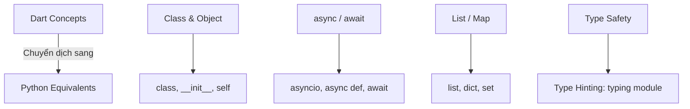
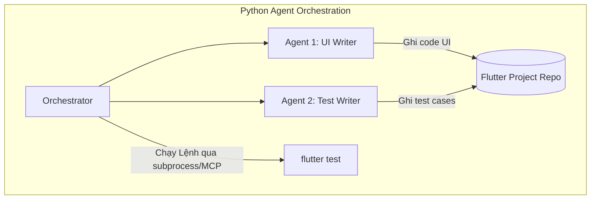

# Lộ Trình Học Tập (Roadmap): Từ Lập Trình Viên Flutter Đến Kỹ Sư AI Agent & MCP (Tập Trung Python)

Quyết định chọn **Python** của bạn là hoàn toàn chính xác và mang tính chiến lược dài hạn. Hầu hết các thư viện AI mạnh mẽ nhất, tài liệu hướng dẫn và cộng đồng lớn nhất hiện nay đều xoay quanh Python.

Dưới đây là lộ trình học tập đã được tinh chỉnh để tập trung 100% vào **Python** dành cho bạn.

---

## Giai Đoạn 1: Làm Quen Với Python Căn Bản
Là một Flutter Developer, bạn đã có tư duy lập trình vững chắc. Bạn chỉ cần học cách chuyển dịch cú pháp từ Dart sang Python:

### Nội dung trọng tâm cần học trong Python:
* **Cú pháp cơ bản**: Biến, vòng lặp, hàm, class (`self`, `__init__`).
* **Type Hinting**: Dart là strongly-typed, còn Python là dynamically-typed. Bạn nên dùng Type Hinting trong Python (như `name: str`, `def check(val: int) -> bool:`) để code dễ đọc và tránh lỗi giống như trong Dart.
* **Xử lý bất đồng bộ**: Thư viện `asyncio` (`async def` và `await`).
* **Quản lý môi trường ảo (Virtual Environment)**: Cách dùng `venv`, `pip` để cài đặt thư viện độc lập cho từng dự án, tránh xung đột trên máy.

---

## Giai Đoạn 2: Khái Niệm Cốt Lõi về LLM & API (Python SDK)
Bắt đầu kết nối code Python của bạn với bộ não AI.

* **Cài đặt & Sử dụng SDK**:
  * Sử dụng SDK chính thức của Google: `pip install google-genai` (cho Gemini 2.0/2.5/3.5).
  * Hoặc thư viện OpenAI: `pip install openai`.
* **Prompt Engineering bằng code**:
  * Cách tổ chức biến, định dạng chuỗi (f-strings) trong Python để tạo prompt động.
* **Structured Output (Pydantic)**:
  * Đây là phần rất quan trọng. Bạn sẽ dùng thư viện **Pydantic** trong Python để định nghĩa cấu trúc dữ liệu mong muốn (giống như định nghĩa class Model trong Dart để parse JSON). AI sẽ bắt buộc phải trả về đúng cấu trúc này.
* **Function Calling (Tool Use)**:
  * Học cách định nghĩa một hàm Python bình thường, sau đó khai báo nó như một công cụ (tool) để LLM tự động gọi khi cần.

---

## Giai Đoạn 3: Model Context Protocol (MCP) với Python
Anthropic cung cấp SDK chính thức cho Python để phát triển MCP.

* **Cài đặt SDK**: `pip install mcp`
* **Viết MCP Server bằng Python**:
  * Tạo một MCP server nhỏ chạy dưới local máy tính của bạn.
  * Định nghĩa các tool tương tác với Flutter CLI (ví dụ: chạy lệnh `flutter test` thông qua thư viện `subprocess` của Python).
* **Kết nối Client**: Cấu hình để các IDE hỗ trợ AI (như Cursor, Claude Desktop) kết nối với MCP server Python của bạn để tự động hóa các tác vụ Flutter.

---

## Giai Đoạn 4: Framework Điều Phối Agent (Orchestration)
Khi bạn đã làm chủ Python và các công cụ, đây là lúc dựng lên hệ thống 2 Agent phối hợp.

### Các thư viện nên nghiên cứu:
* **CrewAI**: Rất dễ tiếp cận. Giúp bạn phân vai (Role), định nghĩa nhiệm vụ (Task) bằng ngôn ngữ tự nhiên và gán công cụ (Tools) cho từng Agent bằng Python rất nhanh.
* **LangGraph**: Framework nâng cao hơn của LangChain. Nó sử dụng đồ thị trạng thái (State Graph). Cực kỳ hữu ích cho quy trình kiểm thử tự động (nếu test fail, quay lại Agent 1 để bắt sửa code UI).

---

## Giai Đoạn 5: Thực Chiến & Tự Động Hóa Flutter
Kết hợp mọi thứ lại với nhau:

* **Tự động hóa CLI Flutter bằng Python**:
  * Sử dụng module `subprocess` của Python để thực thi các lệnh terminal một cách bất đồng bộ.
  * Phân tích (parse) đầu ra của các lệnh `flutter test` hoặc `flutter analyze` để trích xuất dòng code bị lỗi và đưa ngược lại cho AI Agent xử lý.
* **Xử lý tài liệu và ảnh (Multimodal)**:
  * Sử dụng thư viện Python (như `Pillow` hoặc gửi trực tiếp file ảnh qua API Gemini) để UI Agent có thể "nhìn" thấy bản thiết kế UI và đối chiếu với code Flutter sinh ra.
